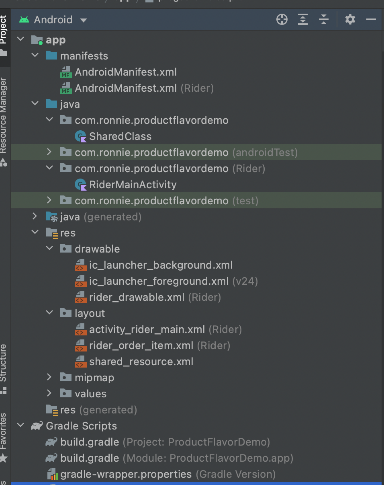

# Product Flavors

If you need to develop more than one app for one project one might think of building two different android projects, fortunately, Android Studio gives us the liberty to create as many flavors as we want. Take for example Client and Rider Apps, the two are connected and share many classes, API among others. It would only make sense if we re-use these classes and have different directories for codes specific to each app. Take a look at the following screenshots.

## Screenshots
|||
|:----:|:----:|

|||
|:----:|:----:|

Follow the medium article [Hilt](https://otieno.medium.com/adding-product-flavors-to-android-309f965e3d9d)